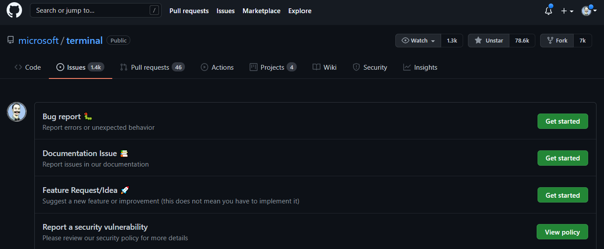

# Windows Terminal FAQs

Find answers to some of the most frequently asked questions about Windows Terminal.

## How do I run a shell in Windows Terminal in administrator mode?

To run Windows Terminal with elevated administrator permission (admin mode), right-click on the Windows Terminal icon, then again on the Windows Terminal title that displays, then select "Run as administrator".


Alternatively, you can open the Windows Quick Access menu using the shortcut, ⊞ Windows key + X, and then selecting Windows Terminal (Admin).

## Is it possible to mix admin and non-admin tabs in a Windows Terminal window?

No, mixing administrator-level permission tabbed shells with those that do not have elevated administrator permission is not supported due to security concerns.

## Can I use Windows Terminal as the integrated terminal in VSCode?

No, Visual Studio Code is xtermjs and written in TypeScript while Windows Terminal is native code.

## What shells does Windows Terminal support?

Windows Terminal will support any command line or shell that you have on your machine, including those that are included with Windows like PowerShell or Windows Command Prompt (cmd.exe), as well as any Linux distribution that can be installed with [WSL](/windows/wsl/), Azure Cloud Shell, Git Bash, etc. The terminal will automatically detect when you've installed a Linux distribution with WSL and create a profile for you. It can also save your Azure credentials, so you can quickly log in quickly to Azure Cloud Shell.

## How can I manually add a shell?

In your [settings.json file](./install.md#settings-json-file), you can create or modify profiles that run any command-line executable. In the settings.json file, set "commandline" to whatever you want. For example, powershell --> "pwsh.exe".

## What is the difference between Windows Terminal and Windows Terminal (Preview)?

Windows Terminal is [open-source](https://github.com/microsoft/terminal) and under active development. The recommended way to [install](./install.md) is via the Microsoft Store, which will provide automatic updates whenever they are released. [Windows Terminal](https://www.microsoft.com/en-us/p/windows-terminal/9n0dx20hk701?rtc=1&activetab=pivot:overviewtab) stable public release receives frequent updates, but the development team has also provided the [Windows Terminal Preview](https://www.microsoft.com/en-us/p/windows-terminal-preview/9n8g5rfz9xk3?rtc=1&activetab=pivot:overviewtab) release for those interested in trying the latest features as they are developed.

## What alternative ways are there to install Windows Terminal?

While we recommend installing Windows Terminal [using the Microsoft Store](https://www.microsoft.com/en-us/p/windows-terminal/9n0dx20hk701?rtc=1&activetab=pivot:overviewtab), you can also install using [Windows Package Manager](https://github.com/Microsoft/terminal#via-windows-package-manager-cli-aka-winget), [GitHub](https://github.com/Microsoft/terminal#via-github), [Chocolatey](https://github.com/Microsoft/terminal#via-chocolatey-unofficial), or [Scoop](https://github.com/Microsoft/terminal#via-scoop-unofficial).

## Is it possible to initialize Windows Terminal profile with a batch file?

Yes. You first need to go to the [Profiles](./customize-settings/profile-general.md) section of your [settings.json file](./install.md#settings-json-file). Using the [`"commandline":` property](./customize-settings/profile-general.md#command-line), you can specify any batch file, command, ssh connection, or executable that you want to run as a profile in Windows Terminal. You just need to enter the path to the file that you want to run.

For example:

```json
{
"commandline": "%USERPROFILE%/OneDrive/demo.bat",
"name": "Batch Profile"
}
```

## What sort of features have open-source community contributors added to Windows Terminal?

There have been a wide variety of [contributions](https://github.com/microsoft/terminal/pulls?q=is%3Apr+is%3Aclosed) to Windows Terminal, including bug fixes, identifying and discussing [issues](https://github.com/microsoft/terminal/issues), [contributing to this documentation](/contribute/), but a few of our favorite features that have come from community contributions have included support for [background images and gifs](./customize-settings/profile-appearance.md#background-images-and-icons), [retro effects](./customize-settings/profile-appearance.md#retro-terminal-effects), and [tab coloring](./customize-settings/profile-appearance.md#tab-color), just to name a few. Learn more about [how to contribute](https://github.com/microsoft/terminal/blob/main/CONTRIBUTING.md).

## What is conhost.exe?

The Windows Console host, conhost.exe, is Windows' original command-line user experience. It also hosts Windows' command-line infrastructure and the Windows Console API server, input engine, rendering engine, user preferences, etc. A primary goal of Windows Console is to maintain backward compatibility, thus adding new features became prohibitive and let to the creation of the Windows Terminal. Learn more in the [Windows Terminal open-source repo](https://github.com/Microsoft/terminal#the-windows-console-host) and in the [WIndows Console docs](/windows/console/definitions#console-host).

## Can I save the layout of all of my open console windows when closing Windows Terminal and restore them when starting a new session?

Yes! As of [Windows Terminal Preview v1.12.2922.0](https://github.com/microsoft/terminal/releases/tag/v1.12.2922.0), you can now save window pane layouts upon closing a terminal session with the [firstWindowPreference](./customize-settings/startup.md#behavior-when-starting-a-new-terminal-session-preview) global setting.

## What is being planned for Windows Terminal? Is there a development roadmap or feature request list that I can contribute to?

Windows Terminal is under very active development. You can view the team's plans on the [Terminal 2.0 Roadmap](https://github.com/microsoft/terminal/blob/main/doc/terminal-v2-roadmap.md) document in the open-source terminal repo. New features go into [Windows Terminal Preview](https://aka.ms/terminal-preview) first, then typically a month after they've been in Preview, those features move into [Windows Terminal](https://aka.ms/terminal).

You can contribute feature Requests or ideas, as well as bug reports, security vulnerabilities, or documentation issues by [filing an issue in the terminal repo](https://github.com/microsoft/terminal/issues/new/choose).



<!-- In progress

## Is there a way to sync your terminal settings across devices?

## Can we expect a status bar on the bottom of Windows Terminal? 
-->
